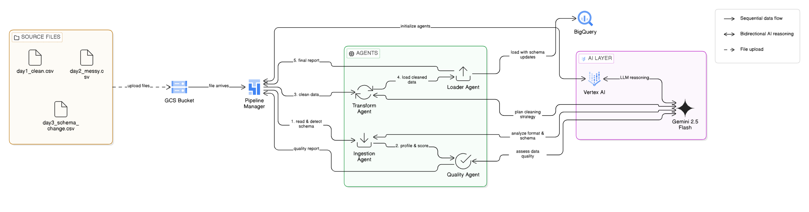

# Autonomous Data Pipeline Setup Guide

Hey! This guide will help you get the pipeline running on Google Cloud. I built this using Google Cloud Shell, so the instructions are based on that experience.

## What This Pipeline Does

Takes messy CSV files from Cloud Storage, cleans them up automatically, and loads them into BigQuery. It uses Gemini (Google's AI) to make smart decisions about the data quality and what to do with it.

📹 [Watch the Video Demo](https://drive.google.com/file/d/1kl9MGzjw1TriPk5d-u9mgYAVCTJRWrKv/view?usp=sharing)


## Architecture Overview

The pipeline uses a multi-agent architecture where each agent has a specific job and uses Gemini AI for intelligent decision-making.

### Architecture Diagram



*High-level view: Files → Agents (powered by Gemini) → BigQuery*

### The 4 Agents

```
┌─────────────┐
│ Cloud       │
│ Storage     │ ← Your CSV files live here
└──────┬──────┘
       │
       ↓
┌─────────────────────────────────────────────────────────────┐
│                    Pipeline Manager                         │
│              (Coordinates all agents)                       │
└──────┬──────────────────────────────────────────────────────┘
       │
       ├──▶ [1] Ingestion Agent
       │     • Reads files from Cloud Storage
       │     • Gemini detects format (CSV/JSON)
       │     • Gemini analyzes schema changes
       │     • Returns: DataFrame + metadata
       │
       ├──▶ [2] Quality Agent  
       │     • Detects: nulls, duplicates, outliers, date issues
       │     • Gemini assesses overall quality
       │     • Returns: Score 0-100 + issue list
       │
       ├──▶ [3] Transform Agent (if needed)
       │     • Gemini plans cleaning strategy
       │     • Removes duplicates (smart: keeps rows with data)
       │     • Standardizes dates (handles any format)
       │     • Caps outliers, fills nulls
       │     • Returns: Clean DataFrame
       │
       └──▶ [4] Loader Agent
             • Validates data is ready
             • Loads to BigQuery
             • Auto-updates schema if needed
             • Returns: Success + row count
```

### How Decisions Are Made

The **Pipeline Manager** uses the quality score to decide what to do:

```
Quality Score < 60
  ↓
  ABORT - Data too poor, reject it

Quality Score 60-80  
  ↓
  CLEAN - Fixable issues, run Transform Agent first

Quality Score > 80
  ↓
  PROCEED - High quality, load directly
```

### Where Gemini AI is Used

Every agent calls Gemini for intelligent analysis:

1. **Ingestion Agent** (line 75 in agents_adk.py)
   ```python
   format_decision = self.reason(
       "What format is this data? CSV or JSON?"
   )
   ```

2. **Quality Agent** (line 165)
   ```python
   assessment = self.reason(
       "Analyze this data quality 0-100, consider severity..."
   )
   ```

3. **Transform Agent** (line 340)
   ```python
   strategy = self.reason(
       "What's the optimal cleaning approach for these issues?"
   )
   ```

4. **Loader Agent** (simplified validation)
   - Uses rule-based checks for speed

5. **Pipeline Manager** (line 100)
   - Uses rule-based routing by default (reliable)
   - Can enable LLM routing for context-aware decisions

### Example Flow: Processing Messy Data

```
Input: day2_messy.csv (15 rows)
  ├─ 3 null amounts
  ├─ 2 duplicate orders  
  ├─ 2 outliers ($95,000, $88,000)
  └─ Mixed date formats

Step 1: Ingestion → "Format: CSV, Schema: [5 columns]"

Step 2: Quality → Score: 70/100, Issues: 4 detected

Step 3: Routing Decision → CLEAN (score in 60-80 range)

Step 4: Transform
  ├─ Remove 2 duplicates (keeps rows with data)
  ├─ Standardize dates to YYYY-MM-DD
  ├─ Cap outliers: $95,000 → $1,000
  └─ Fill nulls: empty amounts → $0
  
Step 5: Load → 13 clean rows to BigQuery ✅
```

### Key Features

- **Smart Deduplication**: Removes duplicates but keeps rows with actual data (not nulls)
- **Universal Date Parsing**: Handles any format: `2025-02-15`, `Feb 15 2025`, `15-02-2025`, etc.
- **Schema Evolution**: Automatically detects new columns and updates BigQuery schema
- **Error Recovery**: Retries failed operations 2x before alerting
- **Full Audit Trail**: Logs every decision and transformation

## What You'll Need

- A Google Cloud project (I used `autonomousdatapipeline`)
- Billing enabled
- About 20 minutes

## Step 1: Set Up Your GCP Project

First, open Cloud Shell from the Google Cloud Console (the little terminal icon in the top right).

```bash
# Set your project ID
export PROJECT_ID="your-project-id-here"
gcloud config set project $PROJECT_ID
```

## Step 2: Enable Required APIs

These are the Google Cloud services we need:

```bash
# Enable the APIs
gcloud services enable aiplatform.googleapis.com
gcloud services enable storage.googleapis.com
gcloud services enable bigquery.googleapis.com

# Wait about 2 minutes for everything to activate
```

## Step 3: Create a Service Account

This gives the pipeline permission to access your Google Cloud resources:

```bash
# Create the service account
gcloud iam service-accounts create pipeline-agent \
    --display-name="Pipeline Service Account"

# Get the email (you'll need this)
export SA_EMAIL="pipeline-agent@${PROJECT_ID}.iam.gserviceaccount.com"

# Give it the permissions it needs
gcloud projects add-iam-policy-binding $PROJECT_ID \
    --member="serviceAccount:${SA_EMAIL}" \
    --role="roles/aiplatform.user"

gcloud projects add-iam-policy-binding $PROJECT_ID \
    --member="serviceAccount:${SA_EMAIL}" \
    --role="roles/storage.objectViewer"

gcloud projects add-iam-policy-binding $PROJECT_ID \
    --member="serviceAccount:${SA_EMAIL}" \
    --role="roles/bigquery.dataEditor"

gcloud projects add-iam-policy-binding $PROJECT_ID \
    --member="serviceAccount:${SA_EMAIL}" \
    --role="roles/bigquery.jobUser"

# Create and download the key
gcloud iam service-accounts keys create ~/pipeline-key.json \
    --iam-account=$SA_EMAIL

# Set it as your credentials
export GOOGLE_APPLICATION_CREDENTIALS="$HOME/pipeline-key.json"
```

## Step 4: Create Cloud Storage Bucket

This is where we'll upload our data files:

```bash
# Create the bucket (pick a unique name)
gsutil mb gs://pipeline-input-YOUR-NAME/

# Upload the test files
gsutil cp day1_clean.csv gs://pipeline-input-YOUR-NAME/
gsutil cp day2_messy.csv gs://pipeline-input-YOUR-NAME/
gsutil cp day3_schema_change.csv gs://pipeline-input-YOUR-NAME/

# Check they're there
gsutil ls gs://pipeline-input-YOUR-NAME/
```

## Step 5: Create BigQuery Dataset

This is where the cleaned data will land:

```bash
bq mk --dataset ${PROJECT_ID}:pipeline_results
```

## Step 6: Install the Pipeline Code

```bash
# Install Python dependencies
pip3 install --user pandas numpy google-cloud-storage google-cloud-bigquery google-cloud-aiplatform

# Download the pipeline code (or upload it from your computer)
# For this example, I'm assuming you have the files locally

# Make sure these files are in your current directory:
# - agents_adk.py
# - orchestrator_adk.py
# - main_adk.py
```

## Step 7: Configure the Pipeline

Edit `main_adk.py` and update these lines (around line 20-23):

```python
PROJECT_ID = "your-project-id-here"      # Your GCP project
BUCKET_NAME = "pipeline-input-YOUR-NAME"  # Your bucket name
DATASET_ID = "pipeline_results"           # Leave as-is
LOCATION = "us-central1"                  # Leave as-is
```

**Optional - Change Gemini Model:**

The pipeline uses `gemini-pro` by default. If you want to use a different model (like `gemini-2.5-flash`), edit `agents_adk.py` line 23:

```python
# Change from:
self.model = GenerativeModel("gemini-pro")

# To:
self.model = GenerativeModel("gemini-2.5-flash")
```

Available models:
- `gemini-pro` - Standard, widely available
- `gemini-2.5-flash` - Fast, newer model (if you have access)
- `gemini-1.5-flash` - Fast, efficient
- `gemini-1.0-pro` - Legacy stable version

## Step 8: Run It!

```bash
python3 main_adk.py
```

You should see output like this:

```
🚀 AUTONOMOUS PIPELINE: day1_clean.csv
✅ Status: SUCCESS
   Rows Loaded: 10

🚀 AUTONOMOUS PIPELINE: day2_messy.csv
✅ Status: SUCCESS  
   Rows Loaded: 13 (after cleaning)

🚀 AUTONOMOUS PIPELINE: day3_schema_change.csv
✅ Status: SUCCESS
   Rows Loaded: 10 (schema updated)

📊 Summary: 3 successful, 0 failed
```

## Step 9: Check BigQuery

Go to BigQuery in the console and run:

```sql
SELECT * FROM `your-project-id.pipeline_results.sales_data` LIMIT 10;
```

You should see all your data there, cleaned and ready to use!

## Troubleshooting

### "Permission denied" errors
Make sure you ran all the `gcloud projects add-iam-policy-binding` commands.

### "Bucket not found"
Check your bucket name in `main_adk.py` matches the one you created.

### "Model not found"
Wait a few minutes after enabling the APIs. Sometimes it takes time to propagate.

### "No module named 'pandas'"
Run the pip install command again with `--user` flag.

## What's Happening Behind the Scenes

1. **Ingestion Agent** reads files from Cloud Storage and uses Gemini to detect the format and schema
2. **Quality Agent** checks for issues (nulls, duplicates, outliers) and gives a quality score
3. **Pipeline Manager** decides what to do:
   - Score < 60: Reject the data
   - Score 60-80: Clean it first
   - Score > 80: Load it directly
4. **Transform Agent** fixes issues (fills nulls, caps outliers, standardizes dates)
5. **Loader Agent** puts the clean data into BigQuery

All of this uses Google's Gemini AI to make smart decisions!

## Files Explained

- `main_adk.py` - Starts everything and processes the files
- `orchestrator_adk.py` - Coordinates all the agents
- `agents_adk.py` - The 4 agents that do the actual work
- `requirements.txt` - List of Python packages needed

## Cost Estimate

For testing with 3 small files:
- Gemini API calls: ~$0.05
- Cloud Storage: ~$0.01
- BigQuery: ~$0.01
- **Total: Less than $0.10**

## Need Help?

Check the other documentation files:
- `CONFIGURATION_GUIDE.md` - How to adjust settings
- `MODEL_TROUBLESHOOTING.md` - If you have Gemini access issues
- `DEPLOYMENT_CHECKLIST.md` - Step-by-step verification

That's it! Let me know if you run into any issues.